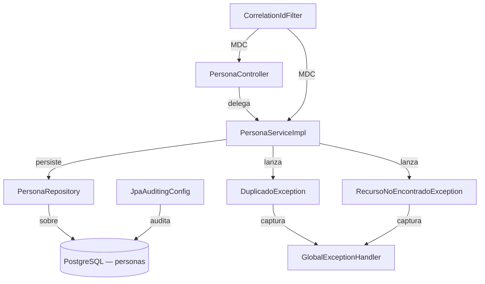

# Design Document — Registro y Consulta de Personas SDD

## Overview

El módulo **Persona** extiende el sistema SDD con la capacidad de registrar personas naturales
con sus datos de identificación documental y datos personales, consultarlas individualmente
(por ID interno o por identidad documental) y listarlas de forma paginada con filtros opcionales.

La versión 1 no incluye operaciones de modificación ni eliminación. El módulo reutiliza sin
modificar la infraestructura común ya existente: `GlobalExceptionHandler`, `PageResponse<T>`,
`JpaAuditingConfig`, `OpenApiConfig`, `SecurityConfig` y `logback-spring.xml`.

### Decisiones de diseño relevantes

| Decisión | Justificación |
|----------|--------------|
| Unicidad documental con `COALESCE` | PostgreSQL trata `NULL != NULL` en índices únicos estándar, lo que permitiría duplicados cuando `complemento` es `NULL`. Usar `UNIQUE (tipo_documento, numero_documento, COALESCE(complemento, ''))` garantiza que `NULL` participa en la unicidad tratándolo como cadena vacía. `NULLS NOT DISTINCT` (PostgreSQL 15+) es equivalente pero menos portable. Se elige `COALESCE` para máxima compatibilidad. |
| Sin modificación ni eliminación | Requerimiento explícito de la versión 1. La identidad documental de una persona es inmutable una vez registrada. |
| `LocalDate` para `fechaNacimiento` | Solo importa la fecha de nacimiento, no la hora ni la zona horaria. Se mapea a `DATE` en PostgreSQL. |
| Mapper estático (`PersonaMapper`) | Consistencia con `UsuarioMapper`. Sin estado, sin inyección de dependencias, sin Lombok `@Mapper`. |
| Filtros dinámicos con `Specification<Persona>` | Consistencia con `UsuarioServiceImpl`. Sin clases `Specification` separadas: lambdas inline en el Service. |
| No se introducen nuevas dependencias | El proyecto ya tiene todo lo necesario: JPA, Bean Validation, Spring MVC, Springdoc, Flyway, PostgreSQL, Mockito, AssertJ. |

---

## Architecture

El módulo sigue la arquitectura en capas del proyecto:

```
HTTP Request
     │
     ▼
PersonaController          ← capa web (slice @WebMvcTest)
     │  @Valid, delega
     ▼
PersonaService (interfaz)
PersonaServiceImpl         ← lógica de negocio, lanza excepciones de dominio
     │  usa
     ▼
PersonaRepository          ← JpaRepository + JpaSpecificationExecutor
     │  sobre
     ▼
PostgreSQL — tabla personas (creada por V2__create_personas_table.sql)
```

Los componentes compartidos del paquete `common` actúan transversalmente:

- `GlobalExceptionHandler` intercepta `DuplicadoException` (→ 409) y `RecursoNoEncontradoException` (→ 404).
- `PageResponse<T>` envuelve los resultados paginados.
- `JpaAuditingConfig` gestiona `fechaCreacion` y `fechaModificacion` automáticamente.
- `CorrelationIdFilter` y `HttpLoggingFilter` proveen trazabilidad y logging HTTP sin modificación.



---

## Components and Interfaces

### Estructura de paquetes

```
com.sdd.sdd.persona
├── controller
│   └── PersonaController
├── dto
│   ├── PersonaRequest
│   └── PersonaResponse
├── entity
│   ├── Persona
│   ├── TipoDocumento   (enum)
│   ├── Genero          (enum)
│   └── EstadoCivil     (enum)
├── mapper
│   └── PersonaMapper   (clase utilitaria estática)
├── repository
│   └── PersonaRepository
└── service
    ├── PersonaService          (interfaz)
    └── PersonaServiceImpl
```

### PersonaController

```java
@Tag(name = "Personas", description = "Registro y consulta de personas naturales")
@RestController
@RequestMapping("/api/personas")
public class PersonaController {

    private static final Logger log = LoggerFactory.getLogger(PersonaController.class);
    private final PersonaService personaService;

    // POST   /api/personas                          → crear(PersonaRequest)       → 201 + Location
    // GET    /api/personas/{id}                     → obtenerPorId(Long)          → 200 / 404
    // GET    /api/personas/documento                → obtenerPorDocumento(...)     → 200 / 404 / 400
    // GET    /api/personas                          → listar(filtros, Pageable)   → 200
}
```

Responsabilidades:
- Recibir requests, aplicar `@Valid`, construir `ResponseEntity`.
- Delegar toda la lógica a `PersonaService`.
- Emitir logs INFO de inicio y fin de operación (sin datos sensibles).
- No acceder directamente a `PersonaRepository`.

### PersonaService (interfaz)

```java
public interface PersonaService {
    PersonaResponse crear(PersonaRequest request);
    PersonaResponse obtenerPorId(Long id);
    PersonaResponse obtenerPorDocumento(TipoDocumento tipoDocumento,
                                        String numeroDocumento,
                                        String complemento);
    PageResponse<PersonaResponse> listar(String nombres,
                                         String apellidoPaterno,
                                         TipoDocumento tipoDocumento,
                                         Pageable pageable);
}
```

### PersonaServiceImpl

Anotaciones de clase: `@Service`, `@Transactional`.
Métodos de solo lectura anotados con `@Transactional(readOnly = true)`.

Lógica por operación:

| Método | Lógica |
|--------|--------|
| `crear` | Verificar unicidad documental con `existsByTipoDocumentoAndNumeroDocumentoAndComplemento`. Si existe → `DuplicadoException`. Si no → mapear a entidad → `repository.save()` → mapear a response. Log WARN en duplicado, INFO en éxito. |
| `obtenerPorId` | `repository.findById(id).orElseThrow(RecursoNoEncontradoException)`. Log WARN si no encontrado. |
| `obtenerPorDocumento` | `repository.findByTipoDocumentoAndNumeroDocumentoAndComplemento(tipo, numero, complemento)`. Complemento llega como `null` cuando no se provee. Log WARN si no encontrado. |
| `listar` | Construir `Specification<Persona>` con lambdas inline para filtros LIKE/exact. `repository.findAll(spec, pageable)`. Mapear a `PageResponse`. |

### PersonaRepository

```java
public interface PersonaRepository
        extends JpaRepository<Persona, Long>,
                JpaSpecificationExecutor<Persona> {

    boolean existsByTipoDocumentoAndNumeroDocumentoAndComplemento(
            TipoDocumento tipoDocumento,
            String numeroDocumento,
            String complemento);

    Optional<Persona> findByTipoDocumentoAndNumeroDocumentoAndComplemento(
            TipoDocumento tipoDocumento,
            String numeroDocumento,
            String complemento);
}
```

> **Nota sobre null en complemento:** Los métodos derivados de Spring Data pasan el parámetro
> directamente a JPQL como `IS NULL` cuando el valor es `null`, por lo que la búsqueda con
> `complemento = null` resuelve correctamente a `WHERE complemento IS NULL`. La constraint de
> unicidad en BD usa `COALESCE(complemento, '')` para la misma equivalencia semántica.

### PersonaMapper

```java
public final class PersonaMapper {

    private PersonaMapper() { throw new UnsupportedOperationException("Utility class"); }

    public static PersonaResponse toResponse(Persona persona) { ... }
    public static Persona toEntity(PersonaRequest request) { ... }
}
```

`toEntity` no asigna `id`, `fechaCreacion` ni `fechaModificacion` — son gestionados por JPA Auditing.

---

## Data Models

### Entidades y enumeraciones

#### `TipoDocumento` (enum)

```java
public enum TipoDocumento { CI, PASAPORTE, CEX, NIT }
```

#### `Genero` (enum)

```java
public enum Genero { MASCULINO, FEMENINO, OTRO }
```

#### `EstadoCivil` (enum)

```java
public enum EstadoCivil { SOLTERO, CASADO, DIVORCIADO, VIUDO, UNION_LIBRE }
```

#### `Persona` (entidad JPA)

```java
@Entity
@Table(name = "personas")
@EntityListeners(AuditingEntityListener.class)
@Getter @Setter @NoArgsConstructor @AllArgsConstructor @Builder
public class Persona {

    @Id
    @GeneratedValue(strategy = GenerationType.IDENTITY)
    @Column(name = "id", nullable = false)
    private Long id;

    @Enumerated(EnumType.STRING)
    @Column(name = "tipo_documento", nullable = false, length = 20)
    private TipoDocumento tipoDocumento;

    @Column(name = "numero_documento", nullable = false, length = 50)
    private String numeroDocumento;

    @Column(name = "complemento", nullable = true, length = 10)
    private String complemento;

    @Column(name = "fecha_nacimiento", nullable = false)
    private LocalDate fechaNacimiento;

    @Column(name = "apellido_paterno", nullable = true, length = 100)
    private String apellidoPaterno;

    @Column(name = "apellido_materno", nullable = true, length = 100)
    private String apellidoMaterno;

    @Column(name = "apellido_esposo", nullable = true, length = 100)
    private String apellidoEsposo;

    @Column(name = "nombres", nullable = false, length = 200)
    private String nombres;

    @Enumerated(EnumType.STRING)
    @Column(name = "genero", nullable = false, length = 20)
    private Genero genero;

    @Enumerated(EnumType.STRING)
    @Column(name = "estado_civil", nullable = false, length = 20)
    private EstadoCivil estadoCivil;

    @CreatedDate
    @Column(name = "fecha_creacion", nullable = false, updatable = false)
    private OffsetDateTime fechaCreacion;

    @LastModifiedDate
    @Column(name = "fecha_modificacion", nullable = false)
    private OffsetDateTime fechaModificacion;
}
```

#### `PersonaRequest` (DTO de entrada)

| Campo | Tipo | Validaciones |
|-------|------|-------------|
| `tipoDocumento` | `TipoDocumento` | `@NotNull` |
| `numeroDocumento` | `String` | `@NotBlank`, `@Size(max = 50)` |
| `complemento` | `String` | `@Size(max = 10)` (opcional) |
| `fechaNacimiento` | `LocalDate` | `@NotNull`, `@Past` |
| `apellidoPaterno` | `String` | Opcional, sin validación adicional |
| `apellidoMaterno` | `String` | Opcional |
| `apellidoEsposo` | `String` | Opcional |
| `nombres` | `String` | `@NotBlank`, `@Size(max = 200)` |
| `genero` | `Genero` | `@NotNull` |
| `estadoCivil` | `EstadoCivil` | `@NotNull` |

Todos los campos documentados con `@Schema(description, example)`.

#### `PersonaResponse` (DTO de salida)

Incluye todos los campos de `PersonaRequest` más `id`, `fechaCreacion` y `fechaModificacion`.
Los enums se serializan como `String` por Jackson. No hay campos de solo escritura.

### Migración Flyway — `V2__create_personas_table.sql`

```sql
CREATE TABLE IF NOT EXISTS personas (
    id                 BIGSERIAL        PRIMARY KEY,
    tipo_documento     VARCHAR(20)      NOT NULL,
    numero_documento   VARCHAR(50)      NOT NULL,
    complemento        VARCHAR(10)      NULL,
    fecha_nacimiento   DATE             NOT NULL,
    apellido_paterno   VARCHAR(100)     NULL,
    apellido_materno   VARCHAR(100)     NULL,
    apellido_esposo    VARCHAR(100)     NULL,
    nombres            VARCHAR(200)     NOT NULL,
    genero             VARCHAR(20)      NOT NULL,
    estado_civil       VARCHAR(20)      NOT NULL,
    fecha_creacion     TIMESTAMPTZ      NOT NULL,
    fecha_modificacion TIMESTAMPTZ      NOT NULL,

    -- Unicidad documental: NULL en complemento participa como cadena vacía.
    -- Se usa COALESCE para compatibilidad con PostgreSQL < 15.
    -- Alternativa en PostgreSQL 15+: UNIQUE NULLS NOT DISTINCT (tipo_documento, numero_documento, complemento)
    CONSTRAINT uq_personas_documento
        UNIQUE (tipo_documento, numero_documento, COALESCE(complemento, '')),

    CONSTRAINT ck_personas_tipo_documento
        CHECK (tipo_documento IN ('CI', 'PASAPORTE', 'CEX', 'NIT')),

    CONSTRAINT ck_personas_genero
        CHECK (genero IN ('MASCULINO', 'FEMENINO', 'OTRO')),

    CONSTRAINT ck_personas_estado_civil
        CHECK (estado_civil IN ('SOLTERO', 'CASADO', 'DIVORCIADO', 'VIUDO', 'UNION_LIBRE'))
);

CREATE INDEX IF NOT EXISTS idx_personas_tipo_documento
    ON personas (tipo_documento);

CREATE INDEX IF NOT EXISTS idx_personas_numero_documento
    ON personas (numero_documento);

CREATE INDEX IF NOT EXISTS idx_personas_documento_completo
    ON personas (tipo_documento, numero_documento, COALESCE(complemento, ''));
```

> **Decisión de unicidad:** La constraint usa `COALESCE(complemento, '')`. Esto significa que
> dos registros con el mismo `(tipo_documento, numero_documento)` y ambos con `complemento = NULL`
> serán rechazados, cumpliendo el Requirement 1.4. El valor `''` (cadena vacía) queda reservado:
> el campo tiene máximo 10 caracteres, y la validación Bean (`@Size(min=1, max=10)` si se agrega)
> puede evitar cadenas vacías explícitas. Sin restricción de mínimo en el diseño actual, este
> detalle debe documentarse para el equipo.

### Contrato de API

| Método | Endpoint | Código exitoso | Códigos de error |
|--------|----------|---------------|-----------------|
| `POST` | `/api/personas` | 201 + `Location` | 400, 409, 500 |
| `GET` | `/api/personas/{id}` | 200 | 404, 500 |
| `GET` | `/api/personas/documento?tipoDocumento=&numeroDocumento=&complemento=` | 200 | 400, 404, 500 |
| `GET` | `/api/personas?nombres=&apellidoPaterno=&tipoDocumento=&page=&size=&sort=` | 200 | 500 |

---

## Correctness Properties

*Una propiedad es una característica o comportamiento que debe mantenerse verdadero en todas
las ejecuciones válidas de un sistema — esencialmente, un enunciado formal sobre lo que el
sistema debe hacer. Las propiedades sirven como puente entre especificaciones legibles por
humanos y garantías de corrección verificables automáticamente.*

El módulo Persona tiene lógica de negocio pura (validaciones, mapeos, filtros dinámicos) sobre
la que las propiedades universales aportan valor real. Los tests de infraestructura (esquema,
auditoría, Swagger) se cubren con ejemplos concretos y smoke tests.

---

### Property 1: Duplicado documental siempre rechazado

*Para cualquier* `PersonaRequest` válido, si se intenta crear una segunda persona con la misma
combinación `(tipoDocumento, numeroDocumento, complemento)` —incluyendo el caso en que
`complemento` sea `null`— el servicio debe lanzar `DuplicadoException` sin invocar
`repository.save()` una segunda vez.

**Validates: Requirements 1.3, 1.4**

---

### Property 2: Complemento ausente equivale a null en la búsqueda por documento

*Para cualquier* persona registrada con `complemento = null`, buscarla por documento sin
proporcionar el parámetro `complemento` debe producir el mismo resultado que buscando con
`complemento = null` explícito. El servicio debe encontrar la persona en ambos casos y devolver
la misma `PersonaResponse`.

**Validates: Requirements 3.3**

---

### Property 3: Filtro por nombres retorna solo personas cuyo campo nombres contiene el valor

*Para cualquier* cadena de filtro `nombres` no vacía, todos los elementos de la `PageResponse`
devuelta por `listar(nombres, null, null, pageable)` deben tener su campo `nombres` conteniendo
el filtro (comparación insensible a mayúsculas). No debe aparecer ningún elemento cuyo `nombres`
no contenga el valor indicado.

**Validates: Requirements 4.2**

---

### Property 4: Filtro por apellidoPaterno retorna solo personas cuyo apellidoPaterno contiene el valor

*Para cualquier* cadena de filtro `apellidoPaterno` no vacía, todos los elementos de la
`PageResponse` devuelta por `listar(null, apellidoPaterno, null, pageable)` deben tener su campo
`apellidoPaterno` conteniendo el filtro (insensible a mayúsculas). No debe aparecer ningún elemento
cuyo `apellidoPaterno` no contenga el valor indicado.

**Validates: Requirements 4.3**

---

### Property 5: Filtro por tipoDocumento retorna solo personas con ese tipo exacto

*Para cualquier* valor de `TipoDocumento`, todos los elementos devueltos por
`listar(null, null, tipoDocumento, pageable)` deben tener exactamente ese `tipoDocumento`. No debe
aparecer ningún elemento con un tipo diferente.

**Validates: Requirements 4.4**

---

### Property 6: Filtros combinados aplican condición AND

*Para cualquier* combinación activa de filtros `(nombres, apellidoPaterno, tipoDocumento)`,
cada elemento de la `PageResponse` devuelta debe satisfacer simultáneamente todos los predicados
activos. Un elemento que cumpla solo alguno de los filtros no debe aparecer en el resultado.

**Validates: Requirements 4.5**

---

### Property 7: Unicidad documental en capa de persistencia

*Para cualquier* persona válida persistida en la base de datos, intentar persistir otra persona
con la misma combinación `(tipoDocumento, numeroDocumento, COALESCE(complemento, ''))` debe
producir una violación de constraint. Esto incluye el caso en que ambos registros tengan
`complemento = null`.

**Validates: Requirements 5.2**

---

## Error Handling

El módulo delega completamente en el `GlobalExceptionHandler` existente. No se crean nuevos
`@RestControllerAdvice`.

| Situación | Excepción lanzada por Service | HTTP resultante | Cuerpo |
|-----------|------------------------------|----------------|--------|
| Identidad documental duplicada | `DuplicadoException` | 409 Conflict | `ApiError` con mensaje descriptivo |
| Persona no encontrada por ID | `RecursoNoEncontradoException` | 404 Not Found | `ApiError` |
| Persona no encontrada por documento | `RecursoNoEncontradoException` | 404 Not Found | `ApiError` |
| Bean Validation fallida | — (Spring MVC lanza `MethodArgumentNotValidException`) | 400 Bad Request | `ApiError` con lista `errores` |
| Parámetros requeridos ausentes | — (Spring MVC lanza `MissingServletRequestParameterException`) | 400 Bad Request | `ApiError` |
| Error inesperado | `Exception` genérica | 500 Internal Server Error | `ApiError` sin detalle interno |

### Mensajes de error documentales

El mensaje de `DuplicadoException` identifica el conflicto sin revelar información sensible:

```
"La combinación de tipo de documento 'CI', número '12345678' ya está registrada."
```

El complemento puede omitirse del mensaje de log (Requirement 7.3) para evitar exposición
si contiene información sensible; en el mensaje de la excepción sí puede incluirse porque
va al cliente como descripción del conflicto.

---

## Testing Strategy

### Resumen de cobertura por capa

| Clase | Framework | Propiedades / Escenarios cubiertos |
|-------|-----------|-----------------------------------|
| `PersonaServiceImplTest` | JUnit 5 + Mockito | Todos los casos de negocio (crear, obtenerPorId, obtenerPorDocumento, listar con/sin filtros) |
| `PersonaControllerTest` | `@WebMvcTest` + MockMvc + `@MockitoBean` | Todos los endpoints: 201, 400, 404, 409 por endpoint |
| `PersonaRepositoryTest` | `@DataJpaTest` | Métodos derivados no triviales + unicidad documental con NULL |

---

### PersonaServiceImplTest

```java
@ExtendWith(MockitoExtension.class)
class PersonaServiceImplTest {

    @Mock
    private PersonaRepository repository;

    @InjectMocks
    private PersonaServiceImpl service;
```

Escenarios obligatorios:

**crear**
- `deberiaCrearPersonaCuandoLosDatasSonValidos` — mock `existsByTipoDocumento…` devuelve `false`, `save` devuelve entidad con id.
- `deberiaLanzarDuplicadoExceptionCuandoLaIdentidadDocumentalYaExiste` — mock `existsByTipoDocumento…` devuelve `true`; verificar `never().save(any())`.
- `deberiaLanzarDuplicadoExceptionCuandoComplementoEsNullYYaExiste` — ídem con complemento `null`.

**obtenerPorId**
- `deberiaRetornarPersonaCuandoElIdExiste`
- `deberiaLanzarRecursoNoEncontradoExceptionCuandoElIdNoExiste`

**obtenerPorDocumento**
- `deberiaRetornarPersonaCuandoLaCombinacionDocumentalExiste`
- `deberiaLanzarRecursoNoEncontradoExceptionCuandoLaCombinacionNoExiste`
- `deberiaInterpretarComplementoAusenteComoNull`

**listar**
- `deberiaRetornarPaginaVaciaCuandoNoExistenPersonas`
- `deberiaRetornarPaginaConResultadosSinFiltros`
- `deberiaFiltrarPorNombres`
- `deberiaFiltrarPorApellidoPaterno`
- `deberiaFiltrarPorTipoDocumento`

---

### PersonaControllerTest

```java
@WebMvcTest(PersonaController.class)
@Import(SecurityConfig.class)
class PersonaControllerTest {

    @TestConfiguration
    static class TestConfig {
        @Bean
        ObjectMapper objectMapper() {
            return new ObjectMapper().findAndRegisterModules();
        }
    }

    @Autowired
    MockMvc mockMvc;

    @Autowired
    ObjectMapper objectMapper;

    @MockitoBean
    PersonaService personaService;
```

Escenarios obligatorios por endpoint:

**POST /api/personas**
- `deberiaRetornar201ConLocationCuandoLaPersonaSeCreaCorrectamente`
- `deberiaRetornar400CuandoNombresEsBlank`
- `deberiaRetornar400CuandoTipoDocumentoEsNull`
- `deberiaRetornar400CuandoFechaNacimientoEsFutura`
- `deberiaRetornar409CuandoLaIdentidadDocumentalEstaduplicada`

**GET /api/personas/{id}**
- `deberiaRetornar200CuandoElIdExiste`
- `deberiaRetornar404CuandoElIdNoExiste`

**GET /api/personas/documento**
- `deberiaRetornar200CuandoLaCombinacionDocumentalExiste`
- `deberiaRetornar404CuandoLaCombinacionNoExiste`
- `deberiaRetornar400CuandoTipoDocumentoEsAusente`
- `deberiaRetornar400CuandoNumeroDocumentoEsAusente`

**GET /api/personas**
- `deberiaRetornar200ConPaginaResultados`
- `deberiaRetornar200ConListaVaciaCuandoNoHayCoincidencias`

---

### PersonaRepositoryTest

Sigue exactamente el patrón de `UsuarioRepositoryTest`:

```java
@DataJpaTest(excludeAutoConfiguration = JpaAuditingConfig.class)
@AutoConfigureTestDatabase(replace = Replace.NONE)
@TestPropertySource(properties = {
        "spring.flyway.enabled=false",
        "spring.jpa.hibernate.ddl-auto=create-drop"
})
@Import(PersonaRepositoryTest.NoOpAuditingConfig.class)
class PersonaRepositoryTest {

    @TestConfiguration
    static class NoOpAuditingConfig {
        @Bean("jpaAuditingHandler")
        AuditingHandler jpaAuditingHandler() {
            AuditingHandler handler = mock(AuditingHandler.class);
            when(handler.markCreated(any())).thenAnswer(inv -> inv.getArgument(0));
            when(handler.markModified(any())).thenAnswer(inv -> inv.getArgument(0));
            return handler;
        }
    }

    @Autowired TestEntityManager em;
    @Autowired PersonaRepository repository;
```

Escenarios obligatorios:

- `existsByDocumento_retorna_true_cuando_combinacion_existe`
- `existsByDocumento_retorna_false_cuando_no_existe`
- `existsByDocumento_retorna_true_cuando_complemento_es_null_y_ya_existe` ← **Property 7**
- `findByDocumento_existente_retorna_optional_con_valor`
- `findByDocumento_inexistente_retorna_optional_vacio`
- `findByDocumento_con_complemento_null_encuentra_registro_sin_complemento` ← **Property 2**
- `unicidad_documental_rechaza_duplicado_con_complemento_distinto` (constraint violation)
- `unicidad_documental_rechaza_duplicado_con_complemento_null_en_ambos` ← **Property 7**

> Las fechas de auditoría se asignan manualmente en el helper `nuevaPersona(...)` igual que en
> `UsuarioRepositoryTest.nuevoUsuario(...)`, dado que el `AuditingHandler` es no-op en tests.

---

### Justificación de ausencia de property-based tests con biblioteca externa

Los siete Correctness Properties identificados son verificables en su esencia mediante:

1. **Propiedades 3, 4, 5, 6** (filtros): El comportamiento varía con el input pero la lógica
   de filtro está en `Specification` lambdas que se pasan a Spring Data JPA — el test relevante
   es unitario con Mockito capturando el argumento `Specification` y verificando que el predicado
   lógico se construye correctamente, complementado con tests de repositorio con datos concretos.
   Un motor PBT externo requeriría acceso a BD para evaluar el predicado, lo que lo convierte en
   un test de integración cuyo valor no aumenta proporcionalmente con 100+ iteraciones.

2. **Propiedades 1, 2, 7** (unicidad documental): Se expresan completamente con tests de
   repositorio usando datos ficticios controlados. La constraint de BD se verifica con 2-3 ejemplos
   representativos que cubren todos los caminos (con complemento, sin complemento, con null).

Por tanto, la estrategia es: **tests unitarios + tests de slice de Controller + tests de repositorio**,
sin añadir una biblioteca PBT externa al proyecto.

---

### Ejecución de tests

```bash
# Compilar
mvn compile

# Ejecutar todas las pruebas
mvn test

# Solo una clase
mvn test -Dtest=PersonaServiceImplTest
mvn test -Dtest=PersonaControllerTest
mvn test -Dtest=PersonaRepositoryTest

# Verificar artefacto
mvn clean package
```

Requisito de infraestructura para `PersonaRepositoryTest`: PostgreSQL disponible en
`localhost:5444/sdd` con las credenciales de `application.properties` (igual que para
`UsuarioRepositoryTest`).
